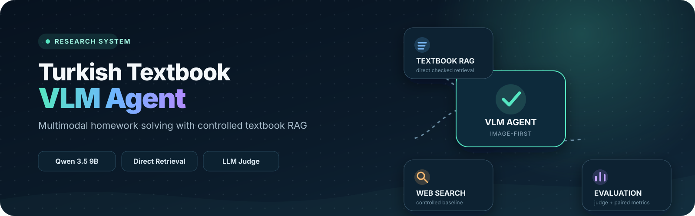
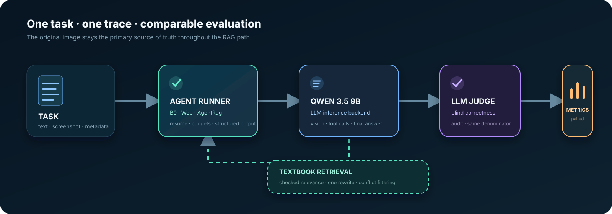

<p align="center">
  
</p>

<h1 align="center">Turkish Textbook VLM Agent</h1>

<p align="center">
  <a href="https://www.python.org/"></a>
  <a href="https://huggingface.co/Qwen/Qwen3.5-9B"></a>
  
  
</p>

<p align="center">
  <strong>Image-first VLM agent · controlled retrieval · reproducible evaluation</strong>
</p>

<p align="center">
  
</p>

VLM-агент для решения школьных заданий на турецком языке с поиском по корпусу
учебников. Репозиторий объединяет три сравниваемых режима агента, retrieval,
LLM-as-a-Judge и приложение для анализа экспериментов.

Исследовательский вопрос проекта: **повышает ли поиск по учебникам качество
ответов по сравнению с той же моделью без инструментов и с веб-поиском?**

<table>
  <tr>
    <td width="25%"><strong>👁 Multimodal</strong><br><sub>Решает задачи по тексту и исходному screenshot.</sub></td>
    <td width="25%"><strong>📚 Controlled RAG</strong><br><sub>Слабые и конфликтующие чанки не попадают в ответ.</sub></td>
    <td width="25%"><strong>⚖ Fair evaluation</strong><br><sub>B0, Web и RAG сравниваются на одинаковых task IDs.</sub></td>
    <td width="25%"><strong>📊 Trace analytics</strong><br><sub>Tool calls, ошибки, fixed/regressed и предметные срезы.</sub></td>
  </tr>
</table>

## Что сравниваем

| Режим | Условие runner | Что получает модель |
| --- | --- | --- |
| 🧠 Без инструментов | `b0_no_tools` | исходный текст или изображение задачи |
| 🌐 Веб-поиск | `b1_search` | задача и инструмент веб-поиска |
| 📚 Textbook RAG | `agent_rag` | задача и ограниченный инструмент поиска по учебникам |

Все режимы возвращают единый `SolveResult`, поэтому их можно оценивать одним
judge и сравнивать попарно на одинаковых `task_id`.

## Быстрый старт

Требуется Python 3.11 или новее. Inference backend настраивается через окружение;
для локального dry-run GPU и запущенная модель не нужны.

```powershell
python -m venv .venv
.\.venv\Scripts\python.exe -m pip install -e ".[sources,dev]"
```

Без сетевого вызова и расходов проверьте сборку входа для модели:

```powershell
.\.venv\Scripts\python.exe -m mla_baseline.runner `
  --tasks data/tasks.sample.jsonl `
  --condition b0_no_tools `
  --dry-run
```

Не добавляйте `.env`, API-ключи, корпуса, индексы и сырые результаты в Git.
Подробные сценарии запуска собраны в
[`docs/getting-started.md`](docs/getting-started.md).

## Как проходит одна задача

<p align="center">
  
</p>

В RAG-режиме изображение остаётся главным источником фактов. Агент получает не
более двух попыток поиска, не передаёт слабые или конфликтующие чанки в финальный
контекст и сохраняет `relevance`, `exit_reason`, `image_evidence` и
`answer_source` в trace. По умолчанию retrieval вызывается напрямую в том же
процессе; HTTP-адаптер оставлен только для раздельного развёртывания.

## Структура репозитория

```text
src/
  mla_baseline/   агент, solvers, tool adapters и batch runner
  retrieve/       индекс, retrieval pipeline, reranking и retrieval-метрики
  vlm_judge/      judge, агрегация, калибровка и интерфейс разметки
  schemas/        общие схемы Task, ImageRef и RetrievedChunk
apps/
  vlm-analytics/  каноническое desktop-приложение аналитики
tests/            основной набор автоматических тестов
scripts/          воспроизводимые entrypoint-скрипты и исследовательские утилиты
configs/          версионированные конфигурации экспериментов
docs/             контракты, протоколы и карта проекта
experiments/      замороженные самодостаточные экспериментальные пакеты
reports/          публикуемые сводки и проверяемые результаты
artifacts/        подготовленные или замороженные артефакты воспроизводимости
data/             локальные задачи, учебники, чанки и индексы; почти всё ignored
results/          локальные сырые прогоны; ignored
outputs/          распакованные датасеты и промежуточные файлы; ignored
```

Плотная карта компонентов, точек входа и таблица «что менять → чем проверять»:
[`docs/project-map.md`](docs/project-map.md).

## Интерфейс аналитики

<p align="center">
  
</p>

<p align="center"><sub>
Пример интерфейса на одном замороженном development replay. Числа на скриншоте
описывают этот конкретный прогон и не являются общей метрикой textbook RAG.
</sub></p>

В приложении можно смотреть accuracy по предметам, paired fixed/regressed,
latency, usage, tool traces и отдельные ответы. Запуск и импорт описаны в
[`apps/vlm-analytics/README.md`](apps/vlm-analytics/README.md).

## Основные команды

```powershell
# Проверить/построить локальный retrieval-индекс.
.\.venv\Scripts\python.exe -m retrieve.build_index --dry-run

# Проверить сборку агента с прямым textbook retrieval без вызова модели.
.\.venv\Scripts\python.exe -m mla_baseline.runner `
  --tasks data/tasks.sample.jsonl `
  --condition agent_rag `
  --dry-run

# Запустить основное desktop-приложение аналитики.
.\.venv\Scripts\python.exe apps/vlm-analytics/main.py

# Запустить основной набор тестов.
.\.venv\Scripts\python.exe -m pytest -q
```

Полные B0/RAG-прогоны используют локальный корпус в `data/chunks/jsonl/` и
квоту настроенного LLM backend. Перед полным запуском используйте `--limit` и
проверьте конфигурацию в `.env.example`.

## Документация

- [`docs/README.md`](docs/README.md) — индекс актуальной документации;
- [`docs/getting-started.md`](docs/getting-started.md) — установка и runbook;
- [`docs/judge-and-data-runbook.md`](docs/judge-and-data-runbook.md) — judge и подготовка данных;
- [`docs/retrieval_tool_contract.md`](docs/retrieval_tool_contract.md) — контракт и политика RAG tool;
- [`docs/evaluation_protocol.md`](docs/evaluation_protocol.md) — честное сравнение и метрики;
- [`docs/data_contract.md`](docs/data_contract.md) — форматы входных и выходных данных;
- [`apps/vlm-analytics/README.md`](apps/vlm-analytics/README.md) — аналитика прогонов;
- [`experiments/README.md`](experiments/README.md) — правила замороженных экспериментов.

## Важные ограничения

- Метрики из разных датасетов, моделей, judge-конфигураций и prompt versions
  нельзя складывать в одну таблицу без явной маркировки.
- `agent_rag` требует локального корпуса и индекса; внешний LLM backend выполняет
  только inference.
- `apps/vlm-analytics/` — каноническое приложение. `apps/vlm_analytics/`
  сохранено как legacy snapshot и не должно получать новые функции.
- Большая часть `reports/`, `artifacts/` и `experiments/` — замороженные
  доказательства прежних запусков. Не переименовывайте их массово: пути входят в
  manifests и проверки воспроизводимости.
