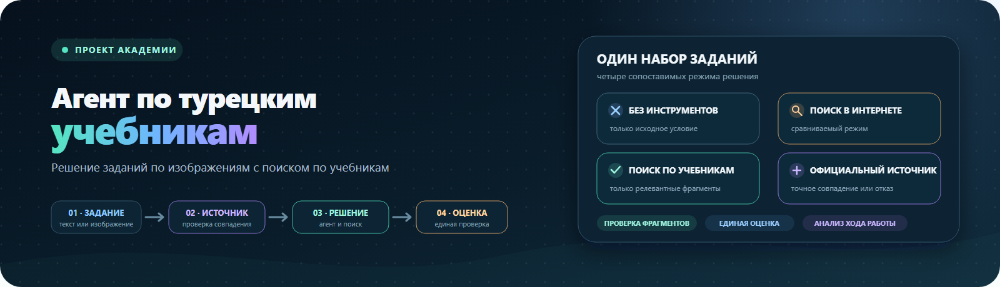
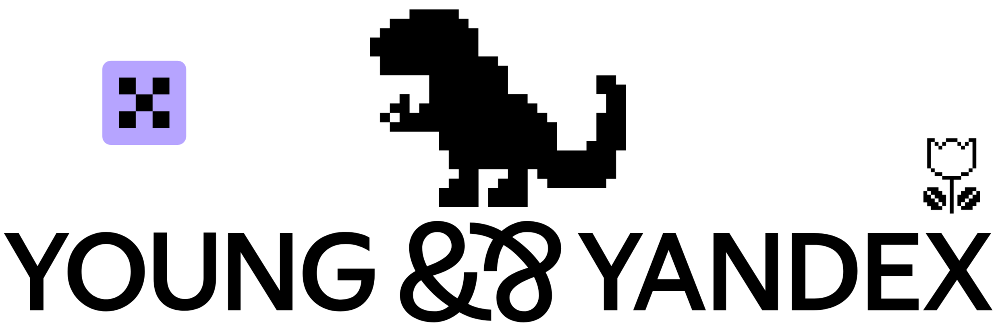
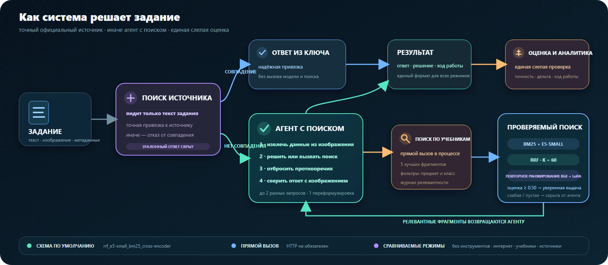
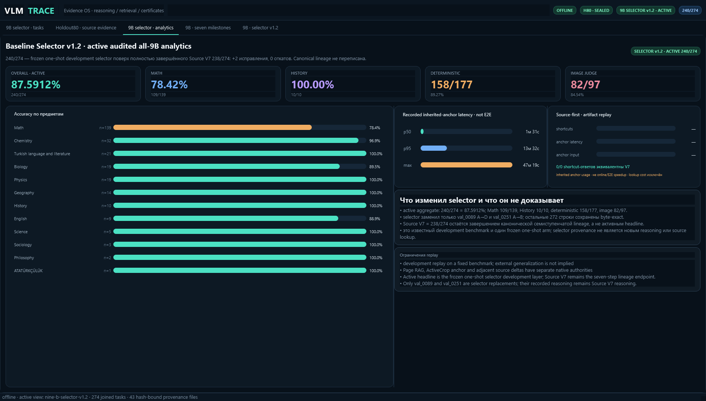

<p align="center">
  
</p>

<p align="center">
  <a href="https://www.python.org/"></a>
  <a href="https://huggingface.co/Qwen/Qwen3.5-9B"></a>
  
  
</p>

<p align="center">
  <a href="#быстрый-старт"><strong>Быстрый старт</strong></a> ·
  <a href="#система-за-минуту"><strong>Архитектура</strong></a> ·
  <a href="#что-сравниваем"><strong>Режимы</strong></a> ·
  <a href="#интерфейс-аналитики"><strong>Аналитика</strong></a> ·
  <a href="#документация"><strong>Документация</strong></a>
</p>

<p align="center">
  <strong>VLM-агент для решения школьных заданий на турецком языке</strong><br>
  <sub>Исходное изображение · проверяемый поиск по учебникам · единая оценка экспериментов</sub>
</p>

<p align="center">
  
</p>

> **Исследовательский вопрос:** повышает ли поиск по учебникам качество ответов
> по сравнению с той же моделью без инструментов и с веб-поиском?

<table>
  <tr>
    <td width="25%"><strong>👁 Image-first</strong><br><sub>Текст и исходный screenshot остаются главным источником условия.</sub></td>
    <td width="25%"><strong>📚 Checked RAG</strong><br><sub>Слабые и конфликтующие чанки не передаются в решение.</sub></td>
    <td width="25%"><strong>⚖ Paired evaluation</strong><br><sub>Solver-режимы сравниваются на одинаковых task IDs.</sub></td>
    <td width="25%"><strong>📊 Trace analytics</strong><br><sub>Tool calls, ошибки, fixed/regressed и предметные срезы.</sub></td>
  </tr>
</table>

## Быстрый старт

Требуется Python 3.11 или новее. Для локального dry-run не нужны GPU и
запущенная модель.

```powershell
python -m venv .venv
.\.venv\Scripts\python.exe -m pip install -e ".[sources,dev]"

.\.venv\Scripts\python.exe -m mla_baseline.runner `
  --tasks data/eval/tasks.sample.jsonl `
  --condition b0_no_tools `
  --dry-run
```

Подробная установка, настройка inference backend и сценарии запуска:
[`docs/getting-started.md`](docs/getting-started.md).

## Система за минуту

<p align="center">
  
</p>

1. `agent_rag_sourced` передаёт роутеру только наблюдаемый текст задачи.
   Точная привязка возвращает ответ из официального ключа; любая неуверенность
   заканчивается `abstain`.
2. После `abstain` image-first `AgentRag` решает задачу сам или делает не более
   двух различных вызовов `textbook_search`. Полученные сведения проверяются на
   конфликт с исходным изображением.
3. Все ветки формируют единый `SolveResult`. Эталон добавляется только в judge
   adapter, поэтому solver его не видит.

<details>
<summary><strong>Подробности поиска и его профилей</strong></summary>

По умолчанию `textbook_search` напрямую вызывает профиль
`rrf_e5-small_bm25_cross-encoder`: Turkish BM25 и multilingual E5-small
объединяются через RRF, затем кандидаты переранжируются BGE cross-encoder с
LoRA-адаптером. Слабая выдача скрывается от агента. Дополнительно доступны
`advanced` и другие именованные профили через `RETRIEVE_PROFILE`.

</details>

## Что сравниваем

| Режим | Условие runner | Доступные данные и инструменты |
| --- | --- | --- |
| 🧠 Без инструментов | `b0_no_tools` | исходный текст или изображение задачи |
| 🌐 Веб-поиск | `b1_search` | задача и ограниченный инструмент веб-поиска |
| 📚 Textbook RAG | `agent_rag` | задача и checked retrieval по учебникам |
| 🔎 Source-aware RAG | `agent_rag_sourced` | fail-closed роутер, затем fallback в `agent_rag` |

Одинаковый контракт результата позволяет применять один judge и считать paired
`fixed/regressed` на совпадающих `task_id`. Числа из разных датасетов, моделей,
prompt versions и judge-конфигураций не объединяются без явной маркировки.

## Интерфейс аналитики

<p align="center">
  
</p>

<p align="center"><sub>
Пример одного замороженного development replay. Значения на скриншоте относятся
только к этому запуску и не являются общей метрикой textbook RAG.
</sub></p>

Приложение показывает accuracy по предметам, paired fixed/regressed, latency,
usage, tool traces и отдельные ответы. Инструкция по импорту и запуску:
[`apps/vlm-analytics/README.md`](apps/vlm-analytics/README.md).

## Карта репозитория

| Компонент | Назначение |
| --- | --- |
| `src/mla_baseline/` | агенты, solver-режимы, tool adapters и batch runner |
| `src/retrieve/` | индекс, retrieval, reranking и retrieval-метрики |
| `src/source_router/` | fail-closed привязка к официальным источникам |
| `src/vlm_judge/` | judge, агрегация, калибровка и интерфейс разметки |
| `src/schemas/` | общие схемы `Task`, `ImageRef` и `RetrievedChunk` |
| `apps/vlm-analytics/` | каноническое desktop-приложение аналитики |
| `experiments/`, `reports/`, `artifacts/` | замороженные эксперименты и evidence |

Плотная карта точек входа, инвариантов и таблица «что менять → чем проверять»:
[`docs/project-map.md`](docs/project-map.md).

<details>
<summary><strong>Основные команды разработчика</strong></summary>

```powershell
# Проверить или построить локальный retrieval-индекс.
.\.venv\Scripts\python.exe -m retrieve.build_index --dry-run

# Проверить сборку source-aware агента без вызова модели.
.\.venv\Scripts\python.exe -m mla_baseline.runner `
  --tasks data/eval/tasks.sample.jsonl `
  --condition agent_rag_sourced `
  --dry-run

# Запустить desktop-приложение аналитики.
.\.venv\Scripts\python.exe apps/vlm-analytics/main.py

# Запустить основной набор тестов.
.\.venv\Scripts\python.exe -m pytest -q
```

Полные B0/RAG-прогоны используют локальный корпус в
`data/corpus/chunks/jsonl/` и квоту настроенного LLM backend. Перед полным
запуском используйте `--limit` и проверяйте `.env.example`.

</details>

<details>
<summary><strong>Данные и локальные артефакты</strong></summary>

- `data/corpus/` — исходный корпус и чанки;
- `data/eval/` — оценочные выборки;
- `data/cache/` — пересобираемые индексы и кэши;
- `results/` и `outputs/` — локальные результаты и промежуточные файлы.

Старую раскладку можно перенести командой
`python scripts/migrate_data_layout.py --apply`. Не добавляйте в Git `.env`,
API-ключи, локальные корпуса, индексы, модели, SQLite-базы и сырые результаты.

</details>

## Документация

| Раздел | Что внутри |
| --- | --- |
| [`docs/README.md`](docs/README.md) | индекс актуальной документации |
| [`docs/getting-started.md`](docs/getting-started.md) | установка и runbook |
| [`docs/retrieval_tool_contract.md`](docs/retrieval_tool_contract.md) | контракт и политика RAG tool |
| [`docs/evaluation_protocol.md`](docs/evaluation_protocol.md) | честное сравнение и метрики |
| [`docs/judge-and-data-runbook.md`](docs/judge-and-data-runbook.md) | judge и подготовка данных |
| [`docs/data_contract.md`](docs/data_contract.md) | входные и выходные форматы |
| [`experiments/README.md`](experiments/README.md) | правила замороженных экспериментов |

<details>
<summary><strong>Важные ограничения</strong></summary>

- `agent_rag` требует локального корпуса и индекса; LLM backend выполняет только
  inference.
- `apps/vlm-analytics/` — каноническое приложение. `apps/vlm_analytics/`
  сохранено как legacy snapshot и не должно получать новые функции.
- Пути в `reports/`, `artifacts/` и `experiments/` входят в manifests и проверки
  воспроизводимости, поэтому их нельзя массово переименовывать.

</details>
