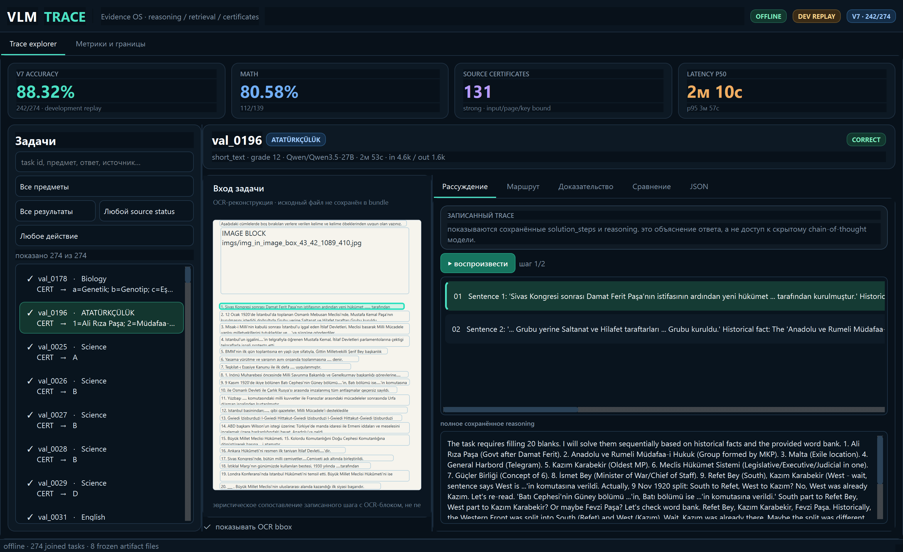
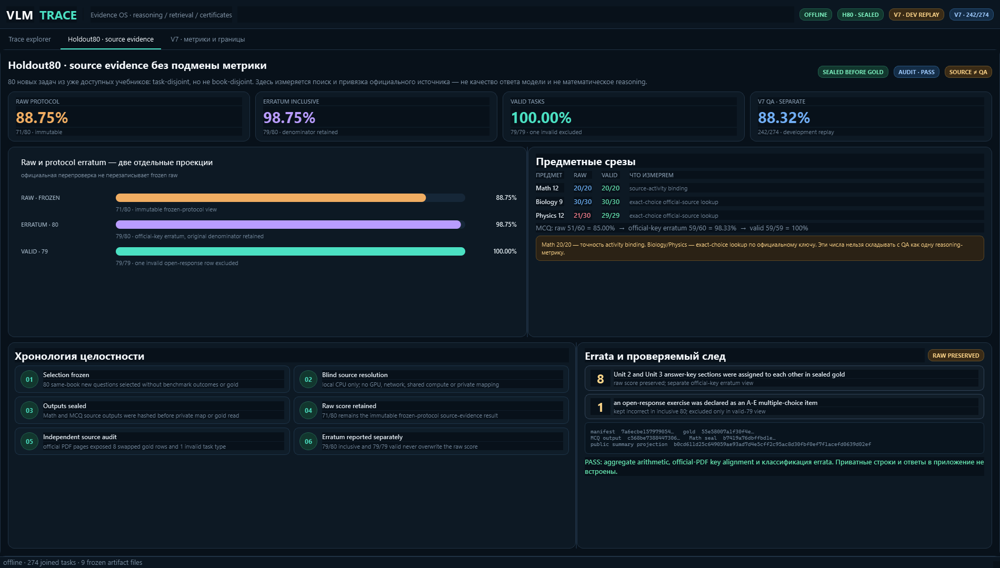
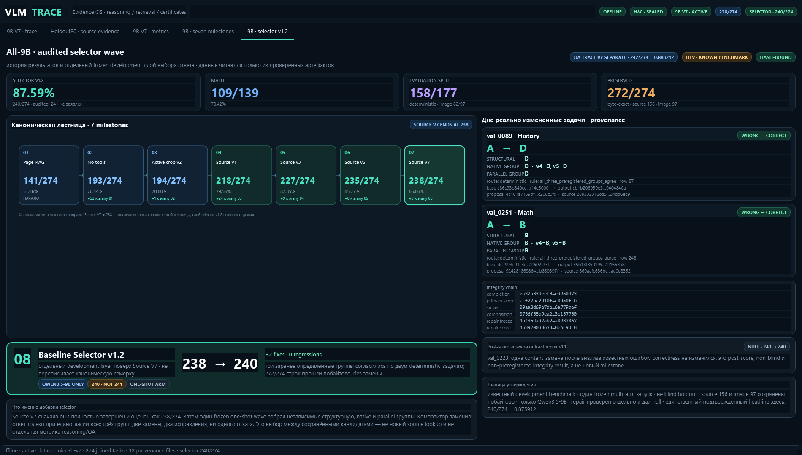
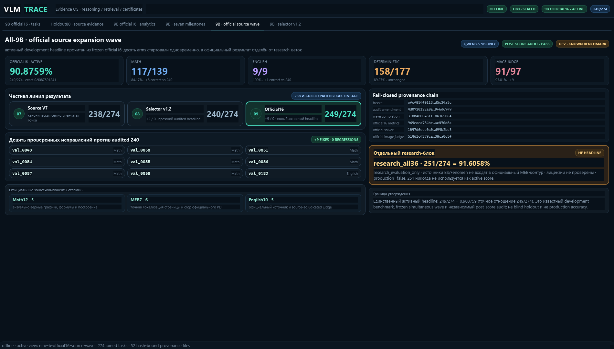
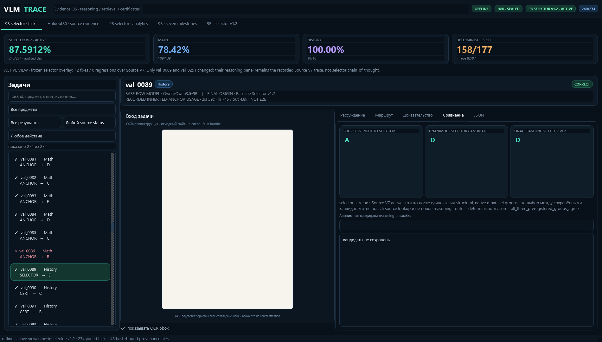

# VLM Analytics

Отдельное desktop-приложение для хранения и анализа прогонов VLM-проекта.

Внутри:

- SQLite-история всех импортированных прогонов;
- метрики по режимам, предметам и датам;
- карточки отдельных задач с сырыми ответами агента и judge;
- статистика reasoning, tools, retrieval и ошибок;
- реестр факапов с ответственным компонентом, статусом и повторяемостью;
- ручной импорт JSONL и синхронизация результатов по SSH.
- парное сравнение каждого режима с no-tools: fixed, regressed и net fixes;
- нормализованный image-first RAG trace: relevance, conflict, answer source и
  exit reason.

## Запуск из исходников

```powershell
python -m venv .venv
.\.venv\Scripts\python.exe -m pip install -r requirements.txt
.\.venv\Scripts\python.exe main.py
```

## Демонстрация trace и provenance

Отдельный read-only экран показывает 274 joined-задачи, сохранённые шаги решения,
маршрут, official-source certificates, сравнение anchor/challenger/final и честные
границы метрик. Он не запускает модель и не изменяет SQLite-базу приложения. Старый
V7 явно подписан как archived/reference: это META-27B anchor с последующими
детерминированными source layers, а не цельный output одной 27B модели. Показанные
latency/tokens относятся только к сохранённому inherited anchor и не являются E2E.

```powershell
.\.venv\Scripts\python.exe trace_viewer.py `
  --artifact-root C:\path\to\VLM_agent_turkish_textbook_basic_rag
```

Перед демонстрацией проверьте bundle командой `trace_viewer.py --validate-only`.
Полное описание, режим скриншотов и трактовка source-first профиля находятся в
[`vlm_trace_viewer/README.md`](vlm_trace_viewer/README.md). Готовый Windows launcher и
трёхминутный сценарий показа описаны в [`DEMO_GUIDE_RU.md`](DEMO_GUIDE_RU.md).

Новый 9B-only режим включается только с полным SHA-замкнутым manifest:

```powershell
.\.venv\Scripts\python.exe trace_viewer.py `
  --nine-b-comparison C:\path\to\comparison.json `
  --dataset auto
```

При успешной проверке он становится default trace. При отсутствии manifest старый
27B экран остаётся только явно помеченным reference; 27B task trace и 9B score не
смешиваются. Exact wrapper/native contract описан в
[`NINE_B_COMPARISON_CONTRACT_RU.md`](NINE_B_COMPARISON_CONTRACT_RU.md).

В отдельной вкладке Holdout80 показан честный source-evidence aggregate: неизменный
raw `71/80`, отдельный official-key erratum `79/80` и `79/79` по валидным строкам.
Он явно отделён от V7 QA `242/274`: source lookup/binding не выдаётся за качество
ответа или reasoning. В приложение встроена только fail-closed публичная сводка с
хешами, без приватных строк holdout.

Отдельная вкладка `9B · official source wave` показывает новый активный all-9B
development result: `249/274 = 90.8759%` (точное отношение `249/274`, опубликованное
округление `0.908759`). Срезы: Math `117/139`, English `9/9`, deterministic
`158/177`, image `91/97`. Loader fail-closed сверяет SHA freeze, независимого audit
amendment, completion и official16 metrics, затем сам пересчитывает task-level
разницу с audited selector `240/274`: ровно девять fixes и ноль regressions.

Старые точки не переписаны: Source V7 `238/274` остаётся концом канонической
семиступенчатой лестницы, а selector v1.2 `240/274` — отдельной проверенной lineage
перед source wave. Research arm `research_all36 = 251/274` показывается только в
отдельном предупреждающем блоке: `research_evaluation_only`, лицензии источников не
проверены, production/headline запрещён. Archived QA V7 `242/274` также остаётся
отдельным reference и не смешивается с all-9B результатом.












## Синхронизация без интерфейса

Перед первой синхронизацией задайте адрес источника через настройки приложения
или переменные окружения. Приватные адреса и логины в репозитории не хранятся.

```powershell
$env:VLM_ANALYTICS_SERVER = "example.org"
$env:VLM_ANALYTICS_USER = "username"
$env:VLM_ANALYTICS_REMOTE_ROOT = "/path/to/v2_274/app"
```

```powershell
.\.venv\Scripts\python.exe main.py --sync-once
```

Локальные OpenRouter-прогоны сервера не требуют. Их можно импортировать из UI
или командой:

```powershell
.\.venv\Scripts\python.exe main.py `
  --import-run-key agent_rag_routed `
  --display-name "E4 Routed image-first RAG" `
  --raw ../../results/openrouter_routed_experiment/<run-id>/agent_rag_routed_raw.jsonl `
  --judge ../../results/openrouter_routed_experiment/<run-id>/agent_rag_routed_judge.jsonl `
  --manifest ../../outputs/validation_merged_20260723/validation_manifest.jsonl `
  --dataset-version validation_images_198

.\.venv\Scripts\python.exe main.py --paired-summary
```

База `vlm_analytics.db` создается рядом с программой. При запуске собранного EXE
это позволяет переносить приложение вместе со всей историей одним каталогом.

## Тесты

```powershell
.\.venv\Scripts\python.exe -m pip install -r requirements-dev.txt
.\.venv\Scripts\python.exe -m pytest -q
```

## Сборка Windows EXE

```powershell
.\build.ps1
```

Отдельная SHA-проверяемая 9B trace-сборка создаётся командой:

```powershell
.\build_trace_viewer.ps1 -CopyToDesktop
```

Она собирает `VLM Analytics 9B.exe`; при наличии canonical frozen comparison под
обнаруженным artifact root приложение валидирует все семь milestones и открывает
9B V7 как default dataset. При отсутствии comparison остаётся только явно
помеченный archived 27B reference.

В Git хранится только код приложения. Локальные SQLite-базы, синхронизированные
JSONL, judge-кэши, изображения учебников и собранные EXE исключены через
`.gitignore`.
