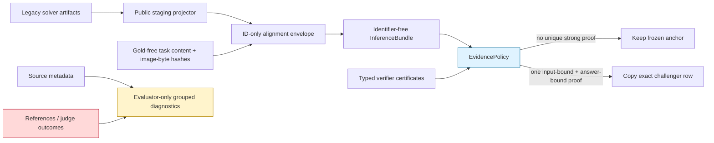

# Maksim Evidence OS v1

Evidence OS v1 is a fail-closed answer-composition layer over the frozen
`205/274` anchor.  Its purpose is not to manufacture a higher development
score from task IDs or previously observed outcomes.  It admits a replacement
only when observable evidence is bound to both the exact input and exact
candidate answer.

## Architecture

The red/yellow evaluator plane is physically outside inference.  `task_id` is
used only to align rows; it is removed before `EvidencePolicy.decide(...)` and
reattached after the decision.  Source URL, source family, row order, hashes,
references, scores and judge verdicts are not policy features.

## Admission gate

A challenger can replace the anchor only when all conditions hold:

1. The answer is non-empty and format-valid.
2. A strong certificate matches the observable-input fingerprint.
3. The same certificate matches the exact normalized-answer fingerprint.
4. Material-claim coverage is `1.0` and contradiction count is zero.
5. Every deterministic check passes and an immutable verifier trace exists.
6. No competing answer (including the anchor) has a conflicting strong proof.

External certificate JSONL is not a trust root.  The production composer
requires a frozen profile, pins the complete certificate artifact by SHA-256,
checks a per-module verifier/kind allowlist, recomputes the inline trace hash,
and verifies that the separately copied raw solver row has the same answer,
error state and forced-answer state as the public candidate seen by policy.
The current profile authorizes no external certificate artifacts.
Production deployment must pin the official profile path/SHA outside the
caller-controlled command; the composer records the profile SHA for audit but
does not treat an untrusted caller as a security boundary.

Agreement, majority vote, model self-confidence, a non-empty citation string,
and a successfully executed but unbound program are deliberately insufficient.

## Why staging is separate

The frozen anchor is a legacy artifact and contains negative attestations such
as `offline_provenance.gold_access=false`.  The inference loader correctly
rejects that raw structure.  `project_maxim_evidence_os_inputs_v1.py` scans the
legacy file, rejects positive/unknown gold access and evaluation-like fields,
then emits a narrow public projection.  Inference reads that projection; the
raw file is used only after selection to copy the exact output row.

## Current cached replay

Five legacy modules were connected in shadow mode: Active Crop, Structural
RAG, Calculator/SymPy, Visual Sketchpad and Parser.  None supplied a qualifying
strong certificate, so the composed solver is an exact byte-for-byte copy of
the anchor:

- solver SHA-256: `aa76740913819b81e23f926e89be68e30501e6f6e14f36867afb3a9f122cc678`;
- score: `205/274 = 0.748175`;
- Math: `108/139 = 0.776978`;
- Non-Math: `97/135 = 0.718519`;
- overrides: `0`.

This is intentional.  The legacy Active Crop and Calculator gates show net
regressions against the current anchor when their differing answers are copied,
while the only Structural-RAG citation agrees with an already-correct anchor.

## Honest grouped-router diagnostic

A nested five-fold source-family cross-fit diagnostic tested whether observable
features could safely choose between the anchor and all five legacy branches.
Hyperparameters were selected inside each outer training split; task IDs,
source locators/families, row order, hashes, references and judge outcomes were
excluded from model features.  All five inner validations selected the
fail-closed anchor:

- OOF router: `205/274 = 0.748175`;
- OOF anchor: `205/274 = 0.748175`;
- family-macro accuracy: `0.757933` for both;
- fixes / regressions / answer overrides: `0 / 0 / 0`;
- split audit: 39 canonical source-document families, with complete families
  held out in every outer fold.

This negative result is useful: the current cached branch metadata does not
contain a transferable signal strong enough to justify changing an answer.
It is an exploratory development diagnostic, not an untouched-book holdout or
a new production metric.

## Reproduction outline

1. Project each legacy solver with
   `scripts/project_maxim_evidence_os_inputs_v1.py`.
2. Run `scripts/compose_maxim_evidence_os_v1.py` with the public projections,
   the required frozen profile, the gold-free task bundle, and an optional
   local image root.
3. Only after `solver.jsonl` is sealed, score it with the frozen evaluator.
4. Run `scripts/evaluate_maxim_evidence_os_grouped_v1.py` for evaluator-only
   source-family diagnostics; it also requires the frozen profile and rejects
   incomplete task/metadata subsets.

The large frozen solver/judge artifacts remain local and are not committed.
A clean clone can run the synthetic leakage and composition tests, but cannot
reproduce the 274-row metric without those SHA-bound artifacts.

## Next admissible improvements

- Rebuild mathematical certificates from OCR/bbox-bound quantities, re-execute
  the expression, validate units/domain/back-substitution, and bind the result
  to the exact answer or option.
- Store claim-level RAG evidence with source hash, page, span/bbox, exact text
  and a round-trip check; a citation label alone remains weak.
- Render real visual transformations and validate crop-to-source geometry plus
  counterfactual consistency before allowing a visual override.

Each module stays disabled until it produces positive net value on a
source-family grouped development experiment and then survives a newly sealed
book/edition holdout.
