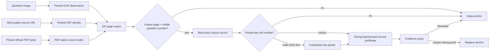

# Maksim official-workbook Evidence OS v1

This experiment extends the fail-closed Evidence OS anchor with answers printed
in pinned public Turkish workbooks. It does not route on task IDs, row order,
previous correctness, benchmark answers, or score. A source answer may replace
the anchor only after the complete source binding succeeds; otherwise the
pipeline keeps the anchor.

## Result

| Variant | Full benchmark | Math | Non-Math | Status |
|---|---:|---:|---:|---|
| Frozen page-RAG | 141/274 (51.46%) | 62/139 (44.60%) | 79/135 (58.52%) | historical baseline |
| Exact official-source anchor | 212/274 (77.37%) | 111/139 (79.86%) | 101/135 (74.81%) | development replay |
| Public workbook choice certificates | 223/274 (81.39%) | 111/139 (79.86%) | 112/135 (82.96%) | development replay |
| + coordinate math-key certificates | 223/274 (81.39%) | 111/139 (79.86%) | 112/135 (82.96%) | development replay |

The coordinate math branch verifies all seven indexed source keys but admits
only one target row under the unchanged `.65 / 10 tokens / .12 margin` routing
gate. That row was already correct and only changes answer formatting, so the
branch is retained as a verified shadow capability rather than claimed as a
metric gain.

The grouped source-family diagnostic for the best run is `0.784829` macro
accuracy across 39 proxy families. Its family-bootstrap 95% interval is
`[0.692255, 0.866012]`. This is diagnostic evidence, not a book-disjoint
production estimate.

## Pipeline

For multiple-choice workbooks the runtime verifies the printed answer and its
question/section/test context in the same PDF. For mathematical short text it
reconstructs fractions and mixed numbers from PDF word coordinates and line
geometry, then checks a pinned projection hash component by component.

## Fail-closed invariants

- The source index is task-ID-free and has strict root/document/locator/question
  allowlists. Task-like document IDs and evaluation-like metadata are rejected.
- Document identity is derived from a strict Yandex public locator and the
  first 12 characters of the pinned PDF SHA-256.
- The OCR-to-source resolver requires an observed printed number, a unique
  content page, minimum coverage/tokens/margin, and exactly one visible number
  marker on the selected page. Numberless matching is disabled.
- Every indexed key is re-read from the pinned PDF. Swapped, shifted, or
  context-misaligned key boxes fail closed.
- The certificate binds the observable input, exact answer, inline trace,
  verifier, source index, PDF bytes, parser artifact, source locators, runtime
  versions, and frozen profile.
- Composition checks `STRONG/PASS`, full claim coverage, zero contradictions,
  all deterministic checks, exact artifact task sets, and anchor/decision/output
  consistency.
- Changed image rows are not evaluated with a verdict cached for the old
  answer. Their OCR-to-source resolution and all PDF keys are rerun before a
  deterministic source-certificate verdict is emitted. The certificate proves
  the final answer, so `reasoning_correct` remains unset.
- Fragment and question ordering is canonical; reversing fragment order yields
  identical merged index bytes and SHA-256.

## Honest limitations

This number is a **previously inspected development replay**. The source set
was assembled while working on this target benchmark, so `223/274` must not be
presented as an untouched holdout or a production generalization estimate.
The hash chain is reproducible under a cooperative internal threat model, but
it was not externally sealed before evaluation and is not tamper-resistant
against rewriting the entire chain.

The next credible production estimate requires a new book/edition-grouped
holdout whose profile, source index, parser inputs, solver and adjudication
protocol are committed or otherwise timestamp-sealed before any reference or
judge outcome is opened.

## Relevant artifacts

- Profile: `configs/maxim_public_workbook_coordinate_v1.json`
- Source index: `reports/maxim_official_exact_source_v2_20260805/frozen/public_workbook_source_index_coordinate_candidate_v1.json`
- Resolver: `reports/maxim_official_exact_source_v2_20260805/public_workbook_coordinate_resolver/manifest.json`
- Composition: `reports/maxim_official_exact_source_v2_20260805/public_workbook_coordinate_composed/manifest.json`
- Certificate adjudication: `reports/maxim_official_exact_source_v2_20260805/public_workbook_coordinate_evaluation/certificate_image_judge_manifest.json`
- Score: `reports/maxim_official_exact_source_v2_20260805/public_workbook_coordinate_evaluation/score.json`
- Grouped diagnostic: `reports/maxim_official_exact_source_v2_20260805/public_workbook_coordinate_grouped_evaluation/grouped.json`
