# Maxim V5: MEB-DEF-10 source-bound table answers

## Objective

V5 extends the frozen V4 public-workbook resolver with one official Grade 10
mathematics PDF. It is an outcome-blind source experiment on a previously
inspected development replay, not a holdout result. V4 at `233/274`
(`0.850365`) remains the retained best result unless the one-shot V5 score is
higher.

## Pipeline

```mermaid
flowchart LR
    A["Gold-blind OCR blocks"] --> B{"Exact visible marker"}
    B -->|"N. / N)"| C["Numbered source record"]
    B -->|"top-left order-1 paragraph title: Örnek N"| D["Example source record"]
    B -->|"missing, conflicting, malformed"| Z["Abstain; keep anchor"]
    C --> E["Frozen page matcher: 0.65 / 10 / 0.12"]
    D --> E
    E -->|"pass"| F["Pinned content crop + marker projection"]
    E -->|"fail"| Z
    F --> G["Connected answer-grid component"]
    G --> H["Exact nearest unit heading"]
    H --> I["Header cell over answer cell"]
    I --> J["Full scalar or ordered multipart answer grammar"]
    J --> K["Source certificate"]
    K --> L["Replace anchor only when answer differs"]
```

No task ID, candidate, judge verdict, score, gold answer, or benchmark outcome
is a routing feature. Task IDs are retained only as opaque row-alignment keys.

## Frozen source contract

- PDF SHA-256:
  `e71895813859032680b2c66a1045501ed15231e6d029eee1ad09ea20dff80447`.
- Physical page count: `356`.
- Source-native records: `8`; merged index: `10` documents and `128`
  records.
- Content proof requires one exact `N.` word or one same-line `Örnek` + `N`
  pair inside a pinned crop, plus the exact indexed question token sequence.
- Parser-side `Örnek N` requires exactly one non-image block with integer
  `block_order == 1`, class `paragraph_title`, exact full-block text, finite
  in-image geometry, and the existing top-left bounds.
- Same-page keys require the exact full unit heading and answer cell to belong
  to the same derived grid component, with that heading nearest before the
  target.
- The one cross-page key additionally requires adjacent pages, aligned outer
  grid edges within `0.75 pt`, prior terminal header `37`, continuation initial
  header `38`, and no new unit heading before the target.
- Multipart answers start at the first character, have at least two unique
  ordered Latin/Turkish labels, reject controls and zero-width/bidi text, and
  compare every complete component to the PDF. A separator is consumed only
  between two labelled components; trailing punctuation such as `;;;;` or
  `////` is rejected. Scalars use whole-string canonical equality.
- One shared fail-closed policy validator is called by the resolver, composer,
  and image-judge builder. The composer additionally compares every accepted
  trace to the frozen source record and the independently projected OCR marker.
  Simultaneous numbered and `Örnek N` markers are a conflict and abstain.

## Frozen page gates

V4 gates are unchanged:

| Gate | Value |
|---|---:|
| minimum IDF coverage | `0.65` |
| minimum matched tokens | `10` |
| minimum page margin | `0.12` |

The actual runtime dry run admits six of eight source records. Five use the
new exact `Örnek N` marker; one uses the existing printed-number marker and
passes with `33/33` matched query tokens. Two abstain: one has only seven query
tokens and zero margin; the other has nine tokens and lacks a valid primary
example title. The earlier exploratory alignment audit used a non-runtime
question-text proxy for one page score and is superseded.

## Pre-score state

- V4 certificates reproduced without any core difference: `111/111`.
- V5 certificates: `117` (`+6`).
- Certified answers equal to the anchor: `93`.
- Strong source overrides: `24`; only two solver rows differ from V4.
- After the remote pre-score freeze, changed image rows will be re-adjudicated
  from the inline source certificate; their prior image-judge outcomes will not
  be used. Reference-derived image-judge rows are not part of this freeze.
- All code, source indexes, profiles, resolver/composer outputs, tests, and
  hashes must be committed and pushed before valid release image-input
  materialization or the first V5 score.

## Sealed pre-score artifacts

| Artifact | SHA-256 |
|---|---|
| resolver manifest | `49aaded6c44f2b595d8bb7402f638ccd826053241f4d163dd0743d637cc19e12` |
| composition manifest | `a0c8ed2f256b479b3102204d7d6d8f3b573a2700e09f66a375d91592749d622d` |
| projection-audit manifest | `f702b6d82dae56948335c2e84e8f86be3c93ce57e26e424cbdb4d6355b73dd4b` |

The final reproducible regression suite reports `121 passed`. The committed V4
composition remains byte-reproducible under the hardened composer, while new
coordinate-table traces must expose every new projection and marker field.

An early local image-input probe exposed that unchanged legacy rows carry
reference-derived verdict fields. That probe is explicitly excluded from the
pre-score commit. The builder must be rerun only after the remote branch equals
the pre-score commit; then the aggregate scorer runs once without retuning.

## Decision rule

Run the scorer once after verifying that the remote branch equals the frozen
pre-score commit. If V5 is worse or equal, keep V4 as the best result and
report the regression/equality. Do not retune this source wave from per-row
outcomes.
