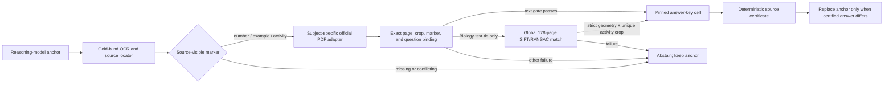

# Maxim V6: Sociology coordinates and global Biology visual binding

## Objective

V6 extends the retained V5 official-source pipeline with two source-native
adapters: three coordinate-bound Sociology multiple-choice records and four
Biology activity-key records.  This is an outcome-blind source experiment on a
previously inspected development replay, not an unseen holdout.  The retained
measured result remains V5 at `234/274` (`0.854015`) until the frozen V6 bundle
is committed, pushed, and scored once.

## Pipeline

There is no generative judge in the measured source overlay.  The replacement
decision is deterministic.  Task IDs are opaque alignment keys and are not a
page, source-record, answer, or routing feature.  No candidate answer, judge
verdict, score, gold answer, or benchmark outcome is read by the source
resolver or visual-evidence generator.

## Sociology adapter

- Official document:
  `yandex_meb_ek_sosyoloji1_846a411a1155`, PDF SHA-256
  `846a411a1155e574a679cd532fe4260aa54839628e9eb0c738f2612b141cd4ef`.
- Three complete source-native question records use
  `coordinate_choice_answer_key`.
- Admission requires a complete observed-to-source stem comparison, at least
  eight source tokens, similarity `>= 0.90`, and a same-page margin `>= 0.25`.
- The answer cell is re-read from the pinned PDF coordinates and must agree
  with the complete indexed record.  Truncated or competing stems abstain.

## Biology activity adapter

- Official document:
  `meb_def_10biyoloji_640bb362f2d5`, PDF SHA-256
  `640bb362f2d53d31663326ac303c5065f4670f2a0d506300beb5e41869384e2b`.
- Four complete ordered activity records use `activity_answer_key`; all answer
  components, labels, content crops, key crops, and projection hashes are
  checked against the PDF.
- Three observations pass the frozen text-page gate.  One honest text tie uses
  the visual fallback.  Visual evidence is never used when the source marker,
  document identity, image hash, or activity number is missing or conflicting.

## Global visual contract

The frozen artifact compares each of four task images against every physical
content page expanded from the Biology document range `[[1, 178]]`:

- `178` rendered pages;
- `4` parser-pinned images;
- `712` SIFT/RANSAC page evidences;
- exactly one globally ranked page per image;
- no answer field and no benchmark outcome access.

The frozen production floor is:

| Gate | Value |
|---|---:|
| good matches | `>= 50` |
| RANSAC inliers | `>= 40` |
| inlier ratio | `>= 0.65` |
| task hull coverage | `>= 0.30` |
| median reprojection error | `<= 1.0 px` |
| mapped-inside fraction | `>= 0.98` |
| scale anisotropy | `<= 1.15` |
| winner/runner score margin | `>= 10.0` |
| winner/runner score ratio | `>= 5.0` |
| mapped crop/source crop IoU | `>= 0.80` |

The composer does not trust the cached evidence.  Under pinned Python 3.12.13,
OpenCV 5.0.0, NumPy 2.5.1, Poppler 26.05.0, one OpenCV thread, disabled OpenCL,
and a fixed RNG seed, it rebuilds all 712 pairs in a fresh subprocess.  The
rebuilt file must be byte-identical to the frozen 570,459-byte artifact.  The
successful pre-score replay produced the same SHA-256:
`131170a808a7455e5be1674399b3d5b444ee088e0185d590fdaf074597f7ac88`.

## Pre-score state

- Frozen merged index: `11` documents and `135` source records.
- Accepted certificates: `124`; abstentions: `150`.
- Certified answers equal to the anchor: `96`.
- Strong source overrides: `28`.
- New certificates relative to V5: seven (`4` Biology, `3` Sociology).
- Final solver changes relative to V5: exactly four rows:
  `val_0162`, `val_0163`, `val_0164`, and `val_0186`.
- Relevant regression suite: `228 passed, 1 skipped`.  The skipped test is the
  optional local OpenCV compute smoke; the real full-page regeneration passed.

## Sealed artifacts before scoring

| Artifact | SHA-256 |
|---|---|
| profile | `825cda4add14ddafdf41beb71386d74701fb8b0c0150c20fd9617ddc82b52058` |
| source index | `715afe9e73b27ded5f52213e24e35da1b397ff9234f2ccf8319a5f6854fc285e` |
| visual evidence | `131170a808a7455e5be1674399b3d5b444ee088e0185d590fdaf074597f7ac88` |
| projection manifest | `bf6e16a133391307ce2de433d459d88b73a0ffe5552df580c1ba585ed5b2d953` |
| resolver manifest | `c1f654ea0bbad88ed597d63b0d961f94d3d51b48b83604e6db0d67dd809491ec` |
| composition manifest | `e2a374021f5ebc224a9947b1e31a35e61a086768d493f096804415cd6f6aa49f` |
| composed solver | `01740f36989e19cec5f809936377bde964befee3c88b3b35f68972e3ee418d57` |

## Evaluation rule

1. Commit the complete source-only bundle and push it.
2. Verify that the remote branch HEAD is byte-for-byte the local pre-score
   commit.
3. Materialize the image-judge input once.  Prior image outcomes may be copied
   only for unchanged rows; all four changed rows must be adjudicated from the
   frozen source certificates and must not consult their prior outcomes.
4. Run the aggregate scorer once.  Do not inspect per-row outcomes and retune
   this source wave.
5. Retain V6 only if its aggregate score is strictly above V5; otherwise retain
   V5 and report the regression or equality.

## Reproducibility boundary

The current bundle proves a fresh same-workspace PDF and visual replay.  It is
not a location-independent fresh-clone package: official PDFs and the pinned
Python/OpenCV/NumPy/Poppler runtime are external hash-verified dependencies,
and generated manifests contain absolute local paths.  The parser artifact and
the four task images are included in the pre-score commit; the large official
PDFs are not.  A different machine must acquire the exact PDF/runtime bytes and
regenerate resolver/composition manifests rather than reuse the serialized
absolute paths.

## Audit separation

One excluded read-only staging audit accidentally enumerated unrelated local
paths because Unix line continuations were used in PowerShell.  It made no
edits, exposed no benchmark score, correctness verdict, or reference answer to
the pipeline, and its output was not used.  A separate clean, path-scoped audit
confirmed the V6 artifacts and staging boundary.  All routing code and source
artifacts above were already built before that incident.
