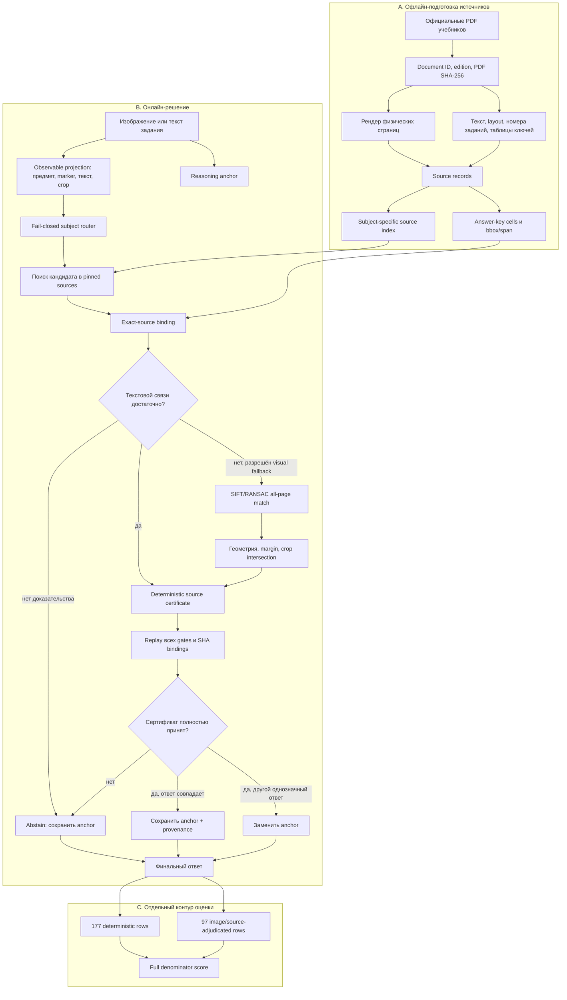
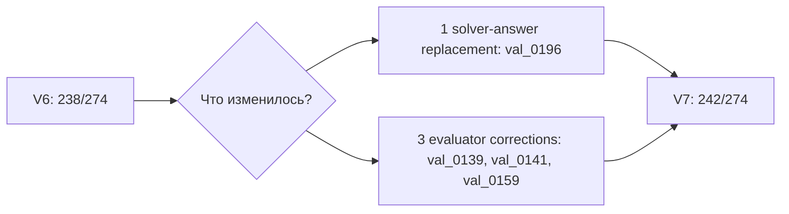

# Финальная архитектура: Evidence OS и source-native V7

## Основной принцип

Архитектура построена вокруг отрицательного права: дополнительная ветка не может менять хороший anchor, пока не выполнит все обязательства доказательства.

```text
нет сертификата        → сохранить anchor
неполный сертификат    → сохранить anchor
конфликт источников    → сохранить anchor или явно abstain
сертификат подтверждает тот же ответ → сохранить ответ и добавить provenance
сертификат однозначно подтверждает другой ответ → разрешить replacement
```

Это и называется `fail-closed`: ошибка, отсутствие данных или неопределённость закрывают путь изменения ответа, а не открывают его.

## Полный поток данных



Контур оценки не участвует в генерации. Reference answer, прежний judge verdict и correctness не являются входами router/resolver/composer.

## 1. Anchor

Anchor — сильный ответ, который система считает правильным по умолчанию. В ранних опытах эту роль выполняла no-tools reasoning ветка. В поздней ladder V7 получает уже замороженный V6 output.

Почему anchor обязателен:

- page-RAG дал 0,5146, тогда как no-tools reasoning дал 0,6971;
- практически у каждой альтернативной ветки были одновременно fixes и regressions;
- выбор «самого уверенного» ответа или majority vote не отличал общий consensus от общей ошибки;
- консервативная композиция позволяет получить пользу от узкого source adapter, не отдавая ему весь benchmark.

## 2. Observable projection

Projection извлекает из входа только наблюдаемые признаки:

- предмет и тип задания;
- распознанный текст и допустимые варианты ответа;
- верхний printed marker или номер активности;
- layout order и bbox;
- видимый page/activity/example label;
- изображение или crop, связанный с заданием.

Пример V2: номер задания восстанавливается из ровно одного order-one блока только при допустимом label, строгом формате `N.`, `N)` или `N -` и геометрии в верхней левой области страницы. Любая неоднозначность приводит к abstain. Положение блока в JSON-массиве не используется.

Запрещённые признаки:

- `task_id`, row number или image SHA как selector готового ответа;
- reference answer или его производные;
- judge verdict/correctness;
- threshold, подобранный после просмотра финального score;
- список ошибок benchmark, превращённый в routing map.

`task_id` допустим только как непрозрачный ключ соединения артефактов одной строки.

## 3. Exact-source binding

Exact-source — это не просто top-1 похожий чанк. Система должна восстановить проверяемую цепочку:

```text
официальный документ
  → точные байты PDF и edition identity
  → физическая страница
  → видимый номер задания / activity / example
  → единственная подходящая source record
  → область ключа ответа
  → нормализованный ответ
```

В разных source adapters использовались разные, но заранее фиксированные обязательства:

- immutable public-document identity и PDF SHA-256;
- page token coverage и margin к следующему кандидату;
- ровно один printed marker на matched page;
- same-row ADIM или same-column subject;
- nearest-section check;
- строгая грамматика значения answer cell;
- повторное чтение ячейки из координат pinned PDF;
- отсутствие конкурирующего source record.

Если один пункт не выполнен, source branch не предлагает replacement.

## 4. Source certificate

Сертификат — машинно проверяемый объект, который связывает наблюдение, источник и предлагаемый ответ. Логически он содержит:

```json
{
  "document_id": "immutable source identity",
  "pdf_sha256": "...",
  "physical_page": 75,
  "record_type": "activity_answer_key",
  "printed_marker": "4",
  "source_record_hash": "...",
  "question_bbox_or_span": "...",
  "answer_bbox_or_span": "...",
  "certified_answer": "...",
  "observation_bindings": ["text", "layout", "image"],
  "passed_gates": ["identity", "page", "marker", "key", "margin"],
  "verifier_version_or_hash": "..."
}
```

Это иллюстрация логического контракта, а не обещание точного имени каждого поля во всех исторических JSON-схемах.

Сертификат выполняет три функции:

1. запрещает «просто поверить» retrieved text;
2. делает решение объяснимым в интерфейсе: можно показать PDF, page, bbox и каждый gate;
3. позволяет детерминированно перепроверить decision без нового вызова LLM.

## 5. Visual binding в V6

Для четырёх Biology observations текстовая привязка не всегда давала единственного победителя. Visual fallback сравнивал каждое task image со всеми 178 content pages официального PDF:

- 178 rendered pages;
- 4 task images;
- 712 SIFT/RANSAC сравнений;
- глобально ранжированная страница для каждого изображения;
- отсутствие answer fields и benchmark outcome в visual artifact.

Production floor V6:

| Gate | Порог |
|---|---:|
| good matches | ≥ 50 |
| RANSAC inliers | ≥ 40 |
| inlier ratio | ≥ 0,65 |
| task hull coverage | ≥ 0,30 |
| median reprojection error | ≤ 1,0 px |
| mapped-inside fraction | ≥ 0,98 |
| scale anisotropy | ≤ 1,15 |
| winner/runner margin | ≥ 10,0 |
| winner/runner ratio | ≥ 5,0 |
| mapped crop/source crop IoU | ≥ 0,80 |

После выбора страницы на ней должна оставаться ровно одна визуально проверенная activity record. Composer повторно строил все 712 пар в отдельном процессе с pinned runtime; результат должен был быть byte-identical frozen artifact.

## 6. Resolver

Resolver принимает source candidate только после проверки всех условий профиля. В V6:

- source index: 11 документов, 135 records;
- accepted certificates: 124;
- abstentions: 150;
- certificates, равные anchor: 96;
- strong source overrides: 28;
- относительно V5 реально изменились четыре финальных ответа.

Большое число accepted certificates не означает такое же число изменений. Сертификат может подтвердить уже существующий ответ — это полезно для provenance, но не меняет метрику.

## 7. Composer

Composer не генерирует новый текст и не голосует. Он реализует короткую таблицу переходов:

| Состояние | Действие |
|---|---|
| certificate отсутствует | anchor |
| certificate не проходит replay | anchor |
| certificate конфликтует с другим источником | anchor/abstain |
| certificate answer == anchor answer | anchor + confirmation trace |
| certificate answer != anchor и все gates пройдены | certified replacement |

Именно эта асимметрия уменьшает regressions. Новый источник обязан доказать replacement; anchor не обязан заново доказывать своё существование на каждой строке.

## 8. Source-aware adjudication V7

V7 разделяет два типа изменения:



На трёх evaluator-correction строках solver answer тот же. Изменяется только оценка, потому что точный официальный certificate сильнее прежнего opaque image-judge verdict. Поэтому для отчёта нужны две цифры, а не одна:

- V6 — solver/source performance;
- V7 — полный source-adjudicated system performance.

## 9. Почему в V7 нет live web search

Локальный отчёт V7 фиксирует: web search ранее добавлял примерно 0,004, но увеличивал задержку и retrieval noise. Кроме того, ранние высокие web-цифры были смешаны с task-ID keyed post-hoc overlays.

В финальном контуре используются заранее закреплённые официальные источники. Web может вернуться как отдельный fallback только при трёх условиях:

1. локальный corpus доказуемо недостаточен;
2. найденный документ получает immutable identity и сохраняется как новый pinned source;
3. online web track измеряется отдельно от closed-corpus track.

## 10. Почему архитектура выбрана именно такой

| Наблюдение | Архитектурное следствие |
|---|---|
| no-tools лучше page-RAG | сохранять reasoning anchor |
| critic и consensus дают regressions | не разрешать замену по уверенности/голосованию |
| semantic RAG выбрал RAG 0/274 | измерять конкретные evidence obligations |
| SymPy ломается на неверной transcription | связывать tool input с bbox/span исходного изображения |
| element retrieval точный, downstream слабый | разделить локализацию и право изменить ответ |
| task-ID overlays дают 0,832–0,960 | запрещать benchmark identity как inference feature |
| image judge ошибается | разрешить source-backed deterministic adjudication |
| source formats различаются | использовать маленькие subject/document adapters и общее certificate core |

## 11. Архитектура для ускорения без потери качества

Этот раздел описывает безопасное направление, а не уже измеренный V7 latency result.

```text
уровень 0: дешёвый anchor и observable projection
уровень 1: sparse/source-index lookup
уровень 2: точный resolver только для небольшого candidate set
уровень 3: visual all-page match только при text tie
уровень 4: генеративный verifier только при конфликте, если вообще разрешён
```

Кэшировать безопасно:

- рендер страниц по PDF SHA;
- parsed layout по PDF SHA + parser version;
- source records и answer cells по document/profile hash;
- visual features по rendered-page SHA + OpenCV profile;
- certificate replay по observation hash + source record hash + verifier hash.

Нельзя кэшировать как переносимый inference policy:

- готовый answer по `task_id`;
- verdict по image SHA без проверки source identity;
- выбранный threshold, если он подбирался на финальном evaluation split.

