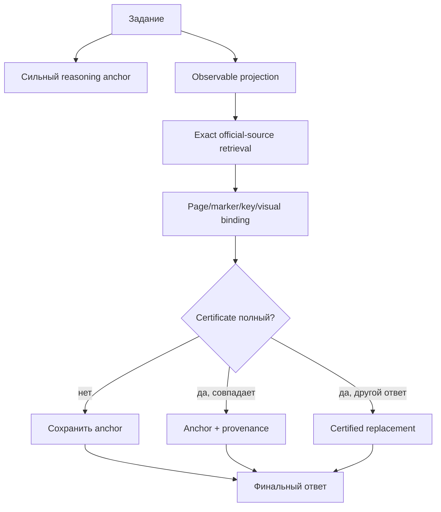

# Постер и демонстрация перед руководителями

## Рекомендуемый заголовок

> **RAG должен доказать право изменить ответ**
>
> Fail-closed VLM-агент с точной привязкой к официальным учебникам

Подзаголовок:

> audited all-9B selector: 0,8759; historical source-adjudicated V7: 0,8832 на inspected development benchmark из 274 задач

Отдельная строка, не продолжение той же кривой:

> Holdout80 same-book source evidence: raw 0,8875; accepted protocol erratum 0,9875; valid-only 79/79

Слово `development` должно быть на основном поле постера, а не в мелкой сноске.

## Главный тезис

Не надо строить рассказ вокруг фразы «мы добавили очень много агентов». Эксперименты показали обратное: critic, consensus, generic tools и always-on RAG часто ухудшают сильную модель.

История должна быть такой:

1. baseline RAG проиграл reasoning-модели;
2. мы измерили множество естественных способов исправить ситуацию;
3. большинство способов одновременно исправляли и ломали ответы;
4. после аудита мы отказались от post-hoc высокой метрики;
5. устойчивый рост появился, когда replacement стал возможен только по точному источнику и сертификату;
6. результат замораживался по source waves до score;
7. sealed same-book Holdout80 подтвердил source binding, но перенос QA на новые книги ещё требует book-disjoint оценки.

## Макет постера

### Верхняя полоса: одна проблема и одна идея

Слева:

```text
page-RAG: 0,5146
no-tools reasoning: 0,6971
```

По центру крупно:

```text
найденный контекст ≠ доказательство
```

Справа:

```text
V6: 0,8686
V7: 0,8832
```

Под этим отдельным блоком:

```text
Holdout80 source evidence
raw frozen: 71/80
erratum: 79/80
valid-only: 79/79
не end-to-end QA
```

### Левая колонка: что не сработало

Достаточно пяти показательных строк:

| Подход | Accuracy | Почему не оставили |
|---|---:|---|
| 8 reasoning + judge | 0,5511 | 4,39× токенов, почти нет gain |
| Solver–Critic–Repair | 0,5620 | critic ломает правильный default |
| SymPy | 0,5219 | неверно распознанные входы дают уверенно неверный proof |
| Structural element RAG | 0,4234 | хороший retrieval не равен хорошему answer selection |
| Parser + solver | 0,3577 | structured OCR не является доказательством смысла |

Рядом короткий вывод:

> **Agreement, confidence и relevance не заменяют verification.**

### Центральная колонка: архитектура



Под схемой одна строка:

> document SHA → physical page → printed marker → answer-key cell → certified answer

### Правая колонка: измеренный путь

| Версия | Accuracy |
|---|---:|
| Page-RAG | 0,5146 |
| No-tools | 0,6971 |
| Conservative meta anchor | 0,7482 |
| Source V1 | 0,8139 |
| V2 | 0,8212 |
| V3 | 0,8394 |
| V4 | 0,8504 |
| V5 | 0,8540 |
| V6 | **0,8686** |
| V7 | **0,8832** |
| All-9B source rebase | 0,8686 |
| All-9B selector v1.2 | **0,8759** |

Под таблицей обязательное разложение:

```text
V6 → V7:
+1 новый правильный solver answer
+3 source-backed evaluator corrections

all-9B 238 → 240:
+2 structural replacements
2 fixes, 0 regressions
source 156 + image 97 byte-preserved
```

V7 и all-9B selector нельзя рисовать как одну последовательную лестницу. V7 наследует другую historical model/evaluator lineage; 0,8759 — текущий строгий all-9B headline.

Если показывать post-score answer-contract repair, подписывать его как null ablation: `240 → 240; 1 formatting repair; 0 outcome diffs`. Он очистил `val_0223` (`} }16` → `16`), но не поднял accuracy. Три generic canonicalization arm дали 0/0/0 изменений.

### Нижняя полоса: честность и следующий шаг

Слева:

- benchmark 274: 139 Math + 135 non-Math;
- 177 deterministic + 97 image/source-adjudicated;
- failures остаются в denominator.

По центру:

- source wave frozen до score;
- task ID alignment-only;
- early 0,832/0,960 quarantined как post-hoc;
- V6/V7 one-shot dev replay.

Справа:

- 80-task task-disjoint in-corpus test;
- clean-room replay;
- end-to-end p50/p95;
- multilingual ingestion smoke.

## Что назвать вкладом

Можно назвать вкладом уровня системы:

1. exact-source binding для учебников с разными типами answer keys;
2. fail-closed certificate arbitration поверх сильного anchor;
3. visual page identity как proof, а не новый generator;
4. source-backed deterministic adjudication конфликтных image rows;
5. process discipline: pre-score freeze, hashes и отказ от post-hoc результата.

Не стоит говорить, что изобретены:

- RAG как класс методов;
- SIFT/RANSAC;
- BM25, dense retrieval или SymPy;
- новый foundation model;
- ColPali, Adaptive-RAG, CRAG или Visual Sketchpad.

## Пятиминутный доклад

### 0:00–0:40 — проблема

> Мы начали с обычного RAG по страницам учебников. Он дал 0,5146. Затем выяснилось, что та же модель без retrieval, но с нормальным reasoning, даёт 0,6971. Значит, проблема была не только в модели: найденный контекст часто получал слишком много доверия и портил правильный ответ.

### 0:40–1:30 — отрицательные эксперименты

> Мы проверили decomposition, восемь рассуждений с судьёй, critic-repair, consensus, SymPy, OCR/parser и element graph. Почти каждая ветка что-то исправляла и что-то ломала. Главный вывод: согласие и уверенность не являются доказательством.

### 1:30–2:40 — решение

> Поэтому мы сохранили сильный reasoning answer как anchor. Source branch ищет не похожий абзац, а конкретную цепочку: официальный PDF, физическая страница, номер задания и ячейка ключа. Изменение разрешается только после детерминированного certificate replay. Если evidence неполное, система fail-closed сохраняет anchor.

### 2:40–3:30 — visual binding

> Когда текста недостаточно, visual branch не решает задачу заново. Он доказывает, что изображение относится к конкретной странице. В V6 четыре изображения сравнивались со всеми 178 страницами через SIFT/RANSAC и строгие геометрические пороги. Это дало четыре clean fixes без regressions относительно V5.

### 3:30–4:20 — результат

> V6 получил 238 из 274, или 0,8686. V7 получил 242 из 274, или 0,8832. Здесь важно разложение: один новый правильный solver answer и три исправления старого VLM-judge verdict по точным официальным источникам. Поэтому мы показываем solver/source и source-adjudicated результаты раздельно.

### 4:20–5:00 — Holdout и ограничения

> V7 остаётся inspected development replay. Отдельно мы провели sealed same-book Holdout80 для source evidence. Frozen raw — 71 из 80. После seal нашли и независимо подтвердили восемь перепутанных Unit 2/Unit 3 labels и один open-response, ошибочно включённый как тест. Поэтому raw мы не стираем: показываем 71/80, рядом protocol erratum 79/80 и valid-only 79/79. Это доказывает точную адресацию внутри известных книг, но не QA accuracy 98,75 процента и не перенос на новую книгу.

## Trace-demo: что показать в интерфейсе

Нужны три заранее выбранных примера.

### Пример A: abstain

Показать:

1. исходное изображение;
2. reasoning anchor;
3. top source candidates;
4. провал одного gate, например margin или marker ambiguity;
5. итог `keep anchor`.

Это лучший пример fail-closed поведения: система выглядит умной не потому, что всегда действует, а потому, что умеет не испортить ответ.

### Пример B: certified replacement

Показать:

1. найденный официальный PDF;
2. physical page и вопрос;
3. выделенную answer-key cell;
4. все passed gates;
5. различие anchor и certified answer;
6. разрешённый replacement.

### Пример C: evaluator correction

Показать неизменный solver answer, старый opaque judge verdict и source certificate, после которого verdict исправляется. Обязательно подписать: `answer unchanged`.

## Визуальные правила demo

- reasoning trace показывать как краткие проверяемые шаги, а не необработанный скрытый chain-of-thought;
- у каждого source hit отображать document, page, record type и score/margin;
- визуально различать `candidate`, `certificate accepted`, `abstain` и `replacement`;
- рядом с каждым gate показывать наблюдаемое значение и порог;
- evaluator correction отделять цветом от answer replacement;
- на экране всегда показывать статус набора: `development replay` или `holdout`.
- на Holdout80 экране всегда разделять `raw frozen`, `protocol erratum` и `valid-only`, а metric label писать как `source evidence`.

## Что не делать на демонстрации

- не выбирать пример после случайного live failure;
- не обещать live web, если production path его не использует;
- не показывать 0,960 как «старую версию» без крупной пометки `invalid/post-hoc`;
- не называть все 4 изменения V7 новыми решениями;
- не скрывать latency и внешние source dependencies;
- не читать длинный сырой reasoning модели как доказательство.

## Однострочные подписи для графиков

- `Accuracy on inspected development replay; not unseen-book holdout.`
- `V6: solver/source result. V7: one answer gain plus three source-backed evaluator corrections.`
- `Task identity is used only for artifact alignment, never for answer routing.`
- `No certificate — no answer change.`
- `Early post-hoc 0.832/0.960 results are excluded from the production claim.`
- `Holdout80 raw is preserved; the eight-label erratum is reported separately.`
- `Same-book source evidence is not end-to-end QA or unseen-book accuracy.`
