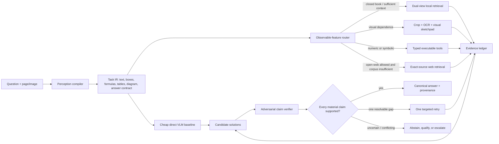
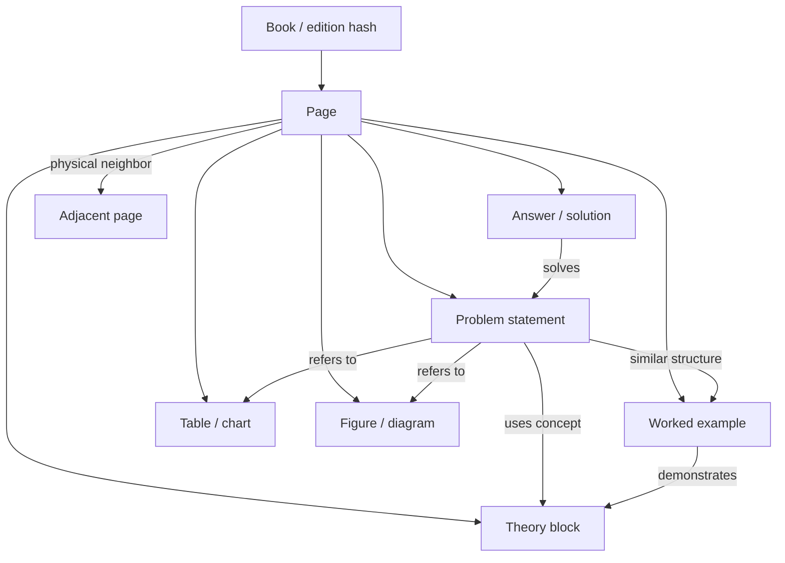
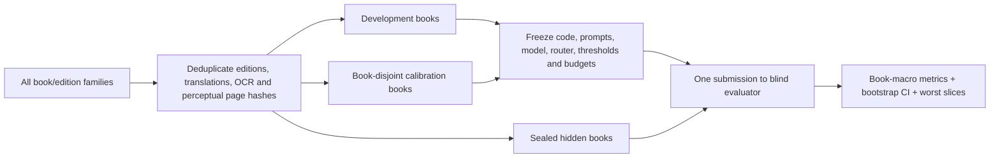

# Maksim experiments: honest result audit and next-pipeline design

Date: 2026-08-04

Benchmark: `5a6a38ccae7835f0d015f6e5979834208347b8e6e7a8d6884e4af97605f51ed9`

Scope: 274 tasks (Math 139, non-Math 135), 177 deterministic-score tasks and 97 frozen image-judge tasks. Failures remain in the denominator.

## Executive conclusion

The best reproducible **gold-blind development result** in the current workspace is:

- **205/274 = 0.748175 overall**;
- **108/139 = 0.776978 Math**;
- **97/135 = 0.718519 non-Math**.

This is the `blind_ensemble_v2default_v3_repair_v1` pipeline. Its inference mechanics do not read the benchmark answer, but the variant was selected after many experiments on the same fixed benchmark. It is therefore a defensible **dev score**, not an unbiased production estimate or untouched-holdout score.

The later values must not be presented as transferable accuracy:

- `0.766423`: six outcome-informed, task-ID keyed exact-web substitutions;
- `0.832117`: task-ID keyed exact-web and deterministic certificate overlays, including image-judge modifications;
- `0.959854`: task-ID/SHA keyed answer certificates and manual `strict_correct` judge overrides.

Those three results remain useful as forensic headroom diagnostics: they show that source identification, exact evidence and executable verification can solve many current failures. They do **not** show that the current router will reproduce the gain on new books.

## Status vocabulary

- **Baseline**: frozen comparator, not a new idea.
- **Gold-blind dev**: the candidate-generation and selection path did not read reference answers, but the result was measured on the repeatedly used development benchmark.
- **Dev-selected**: gold-blind mechanics, but the winning policy was chosen after comparing many variants on the same benchmark.
- **Attribution failure**: the measured score exists, but it does not measure the mechanism named in the table.
- **Post-hoc targeted**: substitutions or policy choices were created after per-task outcome exposure.
- **Invalid generalization claim**: useful only as an audit/upper bound; it is not pipeline accuracy.

## Row-by-row audit of the shared table

| Row | Idea | Result | Math / non-Math | Honest status | What the number actually demonstrates |
|---:|---|---:|---:|---|---|
| 7 | Complex-task decomposition | 150/274 = **0.547445** | 75 / 75 | Gold-blind dev | Decomposition alone did not beat the no-tools baseline. |
| 8 | Eight parallel reasonings plus judge | 151/274 = **0.551095** | 79 / 72 | Gold-blind dev | More samples and a judge added cost but little accuracy. |
| 16 | Element graph over theory/problem/solution blocks | 129/274 = **0.470803** | 57 / 72 | Gold-blind dev, partial proxy | The measured graph had 212,317 nodes and 157,390 edges over 253 books, but the reusable source graph is absent locally; this is not a shipped graph pipeline. |
| 19 | Solver–Critic–Repair | 154/274 = **0.562044** | 79 / 75 | Gold-blind dev | An unconstrained critic often changed correct answers; criticism without evidence gates is unsafe. |
| 20 | Parallel RAG/no-RAG with support gate | 165/274 = **0.602190** | 76 / 89 | Gold-blind dev | This variant used a metadata reliability proxy, not semantic claim support. |
| 21 | Subject/task router | 182/274 = **0.664234** | 103 / 79 | Gold-blind dev | The gain came from a simple observable rule: Math → frozen no-tools; otherwise page-RAG. This is real but narrow. |
| 22 | Eight-way answer clustering/consensus | 139/274 = **0.507299** | 74 / 65 | Gold-blind dev | Correlated answers do not become evidence merely by agreeing. |
| 23 | Calculator/SymPy verification | 143/274 = **0.521898** | 64 / 79 | Gold-blind dev | Only two net fixes; tool invocation and transcription gates were too weak. |
| 24 | Two-pass transcription then solve | 146/274 = **0.532847** | 75 / 71 | Gold-blind dev | A second pass introduced many regressions because it lacked region-level evidence and immutable transcription. |
| 25 | Answer canonicalization | 141/274 = **0.514599** | 62 / 79 | Baseline | Six strings changed, no correctness outcomes changed. |
| 26 | Memory of common error patterns | 155/274 = **0.565693** | 81 / 74 | Gold-blind dev | Generic error memory fixed 47 but regressed 33; memories need typed, evidence-triggered activation. |
| 27 | Frozen page-RAG | 141/274 = **0.514599** | 62 / 79 | Baseline | Page-level reference comparator. |
| 28 | Frozen no-tools reasoning | 191/274 = **0.697080** | — | Baseline | Strongest simple comparator in the original run; any elaborate stage must beat it at matched cost. |
| 29 | RAG/no-RAG plus semantic rating | 193/274 = **0.704380** | 103 / 90 | Attribution failure | The gate selected RAG on **0/274** rows. This is a fair replay of the no-tools branch, not evidence of a RAG gain. |
| 30 | V2.1 default plus conservative V3.1 repair | 205/274 = **0.748175** | 108 / 97 | Gold-blind, dev-selected | Best currently defensible dev pipeline; not untouched-holdout accuracy. |
| 31 | V2.1 default plus Active-Crop repair | 204/274 = **0.744526** | 107 / 97 | Gold-blind dev ablation | Active-Crop repair is competitive but does not beat row 30. |
| 32 | Replace when V3.1 and Active-Crop agree | 204/274 = **0.744526** | 109 / 95 | Gold-blind dev ablation | Pair agreement is a conservative selector, not proof. |
| 33 | Replace when V3.1 and no-tools agree | 204/274 = **0.744526** | 109 / 95 | Gold-blind dev ablation | Same score as row 32 through a different agreement gate. |
| 34 | Replace when Active-Crop and no-tools agree | 195/274 = **0.711679** | 104 / 91 | Gold-blind dev ablation | This pair is materially weaker. |
| 35 | Replace only on three-way unanimity | 204/274 = **0.744526** | 109 / 95 | Gold-blind dev ablation | Unanimity reduced changes, but not enough to exceed row 30. |
| 36 | Unique two-of-three majority | 194/274 = **0.708029** | 104 / 90 | Gold-blind dev ablation | Majority voting lost the useful asymmetric behavior of the best selector. |
| 37 | Visual Sketchpad | 194/274 = **0.708029** | 104 / 90 | Gold-blind dev | Visual tools were conservative, but the implementation reused the same dev benchmark and did not add net gain over its source branch. |
| 38 | Exact-match web routing | 210/274 = **0.766423** | 108 / 102 | Post-hoc targeted | The live content-query router only has a dry run; the measured gain comes from six `task_id` keyed substitutions. |
| 39 | Exact web evidence plus deterministic tools | 228/274 = **0.832117** | 120 / 108 | Post-hoc targeted | Hardcoded exact-web IDs, answer certificates and altered image adjudication make this a headroom experiment, not a transferable score. |
| 40 | Fail-closed lookup plus executable checks | 263/274 = **0.959854** | 132 / 131 | Invalid generalization claim | Task-ID/SHA answer maps and manual `strict_correct` overrides. Keep only as forensic upper bound. |

## Concrete leakage/overfitting evidence

The issue is not that `task_id` exists as a join key. The issue is that it directly selects answers or evaluator outcomes.

- Row 38: `scripts/compose_maxim_exact_official_web_deterministic_v1.py` contains a task-keyed override map and applies it by `task_id`.
- Row 39: task-keyed maps are present in `compose_maxim_exact_official_web_extension_v2.py`, `compose_maxim_public_deterministic_tools_v1.py`, and `compose_maxim_official_image_certificates_v1.py`; `build_maxim_derived_image_tools_judge_v1.py` forces selected `strict_correct` values.
- Row 40: `compose_maxim_executable_proof_extensions_v4.py` and `build_maxim_executable_image_judge_v4.py` use task/SHA keyed maps; the latter also forces `strict_correct`.

These files are retained for auditability and must not be imported into the production package.

## What the experiments teach us

1. **The model is already strong.** No-tools reasoning at 0.697 is a difficult baseline; always-on RAG, critique, consensus and generic tools can easily damage it.
2. **Routing is the largest real gain so far.** The simple, observable subject router reached 0.664 from the 0.515 page-RAG comparator. The next router should use richer observable evidence, not benchmark identity.
3. **Agreement is not verification.** Eight-sample consensus, two-of-three voting and unconstrained critique underperformed. Independent agents are useful only after evidence and tool checks.
4. **RAG must earn the right to affect the answer.** Row 29 did not select RAG once; row 20's metadata gate was too weak. Retrieval relevance, entailment and contradiction must be measured at claim level.
5. **The post-hoc headroom is still valuable.** Rows 38–40 strongly suggest that exact source localization and executable checks are high-value capabilities. The honest engineering task is to discover those certificates from query content on unseen books.

## Proposed pipeline: Evidence OS

The next system is a dual-view, evidence-first pipeline with bounded agentic escalation. Every decision is a function of observable query/source state, and every answer-changing action must produce a transferable certificate.



### 1. Perception compiler and immutable Task IR

Compile the query once into a typed intermediate representation:

```text
task_type, answer_type, options,
ocr_spans[{text, bbox, confidence}], formulas[AST],
tables[cells], diagram_entities, units,
required_claims, visual_dependency, source_constraints
```

The original image, crop coordinates and extraction versions remain immutable. A solver may challenge a transcription, but it cannot silently rewrite it.

### 2. Dual-view element graph

Use both the rendered page and parsed elements; neither is trusted alone.



Index four views: sparse text, dense element text, visual late interaction and graph/hierarchy edges. Retrieval starts cheap, then expands only through observed evidence gaps.

### 3. Router conditioned by reality

Allowed router features include:

- subject/task/modality predicted from the query;
- OCR confidence and disagreement between two parsers;
- formula/table/diagram density;
- retrieval score margin, source diversity and evidence coverage;
- direct-model disagreement and semantic uncertainty;
- answer type, unit constraints and whether a computation can be executed;
- whether web use is allowed and whether the local corpus is demonstrably insufficient.

Forbidden router features include:

- benchmark row number, `task_id`, image SHA lookup or a memorized answer;
- reference correctness, judge verdict or any derivative of them at inference;
- a threshold selected on the final evaluation split;
- exact-question lookup presented as general reasoning without a separately reported duplicate track.

Start the new router in **shadow mode**: log its route and certificate without changing answers. Enable a route only after a frozen calibration split shows a repeatable gain at matched cost.

### 4. Evidence ledger and source duel

Each candidate is decomposed into atomic claims. Every material claim points to:

```text
{source_hash, edition, page, bbox/span, raw crop,
 retrieval query, transformation/tool version, timestamp}
```

If a printed answer key conflicts with an executable derivation, run a **source duel**. Report the conflict and abstain or qualify; never blindly prefer the key or the model.

### 5. Tools as proof producers

Tools do not merely return an answer. They return a typed certificate:

- exact input quantities and their source regions;
- executable expression/program;
- unit and domain checks;
- back-substitution;
- independent recomputation where possible;
- deterministic output hash.

Counterfactual mutation is an additional check: perturb a number, option order or diagram label in a controlled copy. A valid solver should change its derivation consistently. This tests whether the answer follows evidence instead of memorized surface identity.

### 6. Bounded multi-agent stage

Use at most two blind solvers and one adversarial verifier, and only for high uncertainty, conflicting evidence or multi-step derivations. Solvers initially cannot see each other's answer. The verifier may reject or select supported claims, but cannot invent a new answer. One critique round is the default hard budget.

### 7. Calibrated risk controller

The output controller combines evidence coverage, retrieval dispersion, contradictions, tool disagreement, route OOD and semantic uncertainty. Thresholds are frozen on a book-disjoint calibration set. Depending on risk, it returns:

- a fully supported answer;
- a shorter qualified answer;
- a clarification request;
- `not supported by the provided edition`.

Accuracy alone is insufficient. Report the entire risk–coverage curve, calibration error, cost and latency.

## Evaluation protocol that can support a production claim



Mandatory rules:

1. Split by **book/edition family before question creation**, never by pages or questions.
2. Keep closed-corpus and web-augmented tracks separate.
3. Report exact/near duplicates as a separate lookup track, never inside generalization accuracy.
4. Freeze commit, prompts, model weights, router, thresholds, tool versions and budgets before hidden evaluation.
5. The inference process must be unable to read labels, judge outputs or aggregate score.
6. Measure book-macro accuracy, Math/non-Math and modality slices, retrieval Recall@k, citation precision/completeness, numeric/unit correctness, risk–coverage, cost and p50/p95 latency.
7. Use book-cluster bootstrap confidence intervals and publish regressions, not only the best aggregate score.
8. Retire any graph, critic, verifier or router stage that fails a matched-budget hidden-book ablation.

## Release gates for the first honest vNext

| Component | Initial gate |
|---|---|
| Source integrity | 100% citation pointers round-trip to the frozen book/edition hash |
| Retrieval | Evidence-page Recall@10 ≥ 90% overall and ≥ 85% on every declared modality slice |
| Router | ≤ 2 percentage points regret vs offline policy oracle and ≥ 30% lower median cost than always-deep routing |
| Claims | Every material/numeric claim has a source pointer or executable certificate |
| Tools | 100% schema, execution, provenance and unit validation |
| Selective answering | Pre-register target risk and report coverage; example engineering target: ≤ 5% error at ≥ 70% coverage |
| Multi-agent stage | Enable only if a paired hidden-book ablation improves ≥ 1 absolute point with CI above zero |
| Whole system | Beat no-tools, page-RAG, simple hybrid RAG and visual RAG at matched budgets on hidden books |

## External design basis

- [Adaptive-RAG](https://aclanthology.org/2024.naacl-long.389/) motivates routing among no-retrieval, one-pass and iterative retrieval by observable complexity.
- [Corrective RAG](https://arxiv.org/abs/2401.15884) motivates retrieval-quality evaluation, corrective actions and web fallback when the local corpus is insufficient.
- [ColPali](https://arxiv.org/abs/2407.01449) supports a visual late-interaction view alongside OCR/text indices for visually rich documents.
- [Visual Sketchpad](https://arxiv.org/abs/2406.09403) supports tool-mediated visual reasoning for geometry and diagrams.
- [PAL](https://proceedings.mlr.press/v202/gao23f) supports offloading symbolic and arithmetic execution to a runtime.
- [RAGTruth](https://aclanthology.org/2024.acl-long.585/) is a reminder that retrieved context does not prevent unsupported or contradictory generation.
- [Conformal abstention](https://arxiv.org/abs/2405.01563) motivates calibration and explicit abstention instead of forcing a guess.

## Decision

Production development should branch from row 30's gold-blind mechanics, but it must not preserve its dev-selected thresholds as truth. Rows 38–40 are quarantined as forensic research. Their transferable ideas—exact source discovery, evidence certificates, typed executable checks and fail-closed behavior—must be rebuilt as content-conditioned operators and validated only on book-disjoint hidden data.
