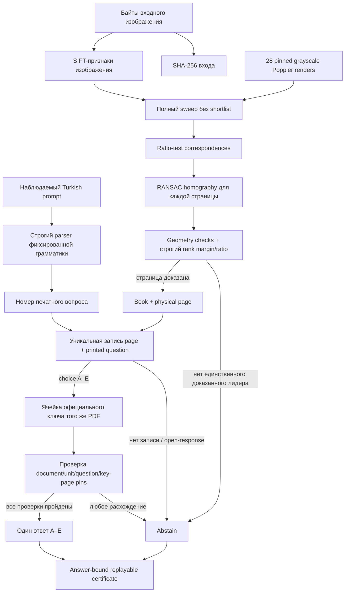

# Полностраничный exact-source резолвер для Biology 9 и Physics 12

## Что именно сделано

Этот модуль закрывает узкую задачу: по изображению полной страницы турецкого
учебника определить конкретную книгу и физическую страницу, по тексту
наблюдаемого промпта определить номер вопроса на этой странице и только после
этого взять ответ из официального ключа той же версии PDF.

Это не ещё одна языковая модель и не BM25-поиск по тексту. Решение является
детерминированным инструментом установления источника. Оно не принимает
`task_id`, разметку выборки, gold-ответ, прежний prediction, score или verdict.
Входом политики являются только два объекта, которые доступны и в реальном
продукте: текст пользовательской инструкции и байты изображения.

Модуль изолирован в `mcq_fullpage_source` и не меняет замороженный код
Math12. Отдельный opaque-batch адаптер сохраняет `input_id` только для
выравнивания выходных строк, но никогда не передаёт его функции разрешения
источника.

## Почему прежний результат BM25 нельзя было считать доказательством

В публичной диагностике все 60 MCQ удавалось вернуть к исходным страницам
через текст, извлечённый из чистого PDF. Такой round-trip полезен как проверка
того, что вопросы действительно происходят из учебников, но он не отвечает на
главный вопрос: сможет ли система найти ту же страницу по реальному
изображению, не зная заранее источник строки.

Чистый PDF и изображение задания — разные наблюдения. В первом случае уже
доступен почти идеальный текст документа. Во втором нужно доказать визуальную
идентичность страницы, выдержать масштабирование, возможное JPEG-сжатие и
различия растеризации. Поэтому показатель `60/60 BM25` не переносится в
метрику image-to-source и не используется как заявленная accuracy нового
резолвера.

## Полный source-native census

Индекс строится не из выбранных 60 задач, а из всего заранее объявленного
публичного пространства адресов двух книг.

| Источник | SHA-256 PDF | Страниц | Адресов протокола | Официальных A–E |
|---|---|---:|---:|---:|
| MEB Biology 9 | `717548090c5bece21242fab41a3dad26aa43031f5a73d4191538903ab3ec4ea0` | 173 | 30 | 30 |
| MEB Physics 12 | `0957cb2a74ed46d6b7c3a3165863e03b5a7206cdf444f6ad8ecf6a13179a6307` | 275 | 117 | 113 |
| Всего | — | 448 | 147 | 143 |

Вопросы распределены по 28 физическим страницам с заданиями. Официальные
ключи расположены на шести физических страницах: Biology p158, p160, p162 и
Physics p263, p264, p265. Для каждой из 143 поддерживаемых ячеек сохранены
номер блока, номер вопроса, буква ответа, bbox номера и буквы, hash текста
ячейки и hash её source-проекции.

Builder дополнительно проверяет 151 реально напечатанную буквенную ячейку.
Разница возникает потому, что таблица Physics U3 содержит восемь правильных
MCQ вне заранее замороженного пространства адресов. Они используются как
контроль целостности таблицы, но не добавляются в индекс постфактум.

## Обнаруженный дефект публичного протокола

Диапазон Physics U2 был публично задан как q24–38. Проверка официальной книги
показала, что q24–27 не являются вопросами с выбором A–E:

- q24 требует текстового объяснения изменения периодов;
- q25 требует текстового ответа о длине маятника;
- q26 имеет числовой ответ `10/9 m`;
- q27 требует построения трёх графиков.

Буквенная таблица этого раздела начинается только с q28. Поэтому честный census
равен 143 A–E и четырём неподдерживаемым open-response адресам, а не 147
буквенным вопросам. Для q24–27 не создаются искусственные буквы. Даже если
вручную подложить поддельную ячейку ключа, проверка типа исходного задания
заставляет резолвер воздержаться.

До freeze не проверяется, попал ли какой-либо из этих четырёх адресов в
выбранный holdout. После freeze это должно оформляться отдельным аудитом
влияния/erratum. Заменять строки выборки постфактум нельзя.

## Архитектура

Одна страница может содержать несколько вопросов. Поэтому одинаковый SHA
изображения разрешён для разных промптов: изображение определяет страницу, а
наблюдаемый номер в промпте — вопрос. Полностью одинаковая пара
`(prompt SHA, image SHA)` считается дубликатом и отклоняется.

## Визуальное доказательство страницы

Каждая входная картинка сравнивается со всеми 28 кандидатными страницами.
Shortlist по предмету, номеру строки или предыдущей разметке не применяется.
Для каждого кандидата сохраняются:

- число good matches после Lowe ratio test;
- число RANSAC inliers и их доля;
- доля площади входного изображения, покрытая inlier hull;
- median reprojection error;
- доля проецируемого четырёхугольника внутри страницы;
- anisotropy масштаба;
- сохранение ориентации и выпуклость проекции;
- полный source identity: document id, PDF SHA, physical page и render SHA.

Пороговый профиль фиксирован до чтения opaque holdout:

| Проверка | Порог |
|---|---:|
| good matches | не меньше 50 |
| RANSAC inliers | не меньше 40 |
| inlier ratio | не меньше 0.65 |
| task hull fraction | не меньше 0.30 |
| median reprojection error | не больше 1.0 px |
| mapped-inside fraction | не меньше 0.98 |
| scale anisotropy | не больше 1.15 |
| rank-score margin | не меньше 10.0 |
| rank-score ratio | не меньше 5.0 |

Нельзя передать в API даже более строгий изменённый профиль: любой override
считается другим экспериментом и отклоняется. Это не даёт незаметно подбирать
пороги после просмотра результатов.

## Привязка официального ответа

После доказательства страницы резолвер ищет ровно одну запись с номером из
промпта на этой физической странице. Затем он требует, чтобы:

1. запись относилась к типу `choice_A-E`;
2. в key index была ровно одна ячейка с тем же source record id;
3. совпали книга, раздел и номер вопроса;
4. key page входила в заранее объявленные страницы ключей этой книги;
5. ответ был одной буквой A–E;
6. hash key-проекции соответствовал замороженному индексу.

Только после этих проверок буква попадает в сертификат. Сертификат связан с
SHA входного изображения, SHA исходного и нормализованного промпта, полными 28
visual evidences, тремя projection hashes источников, replayed decision, буквой
ответа и hash конкретной key-cell. Любое изменение evidence, промпта, ответа,
решения или источника ломает replay.

## Runtime pins

| Компонент | Замороженное значение |
|---|---|
| Python | `3.12.13` |
| pdfplumber | `0.11.9` |
| NumPy | `2.5.1` |
| OpenCV | `5.0.0` |
| Poppler | `26.05.0` |
| `pdftoppm.exe` SHA-256 | `742cbbd9a00931ad16c6618410bc40471375d639a45c61c1d86f3dcfc54b6388` |
| render | 144 DPI, Poppler `-gray`, 8-bit RGB PNG container |
| SIFT max features | 12 000 |
| RNG seed | 19 870 511 |

Poppler в этой pinned сборке кодирует вывод `-gray` как RGB PNG (color type 2),
хотя цветовые значения являются серыми; поэтому manifest честно называет
режим `poppler_gray_rgb_png`. Manifest содержит все 28 адресов, SHA и размер каждого PNG, его
ширину и высоту, версию и SHA исполняемого Poppler. Loader повторно проверяет
байты файлов и PNG IHDR перед любым visual matching.

## Защита opaque batch

Batch-loader принимает только фиксированную схему с `input_id`, `prompt`,
`language`, `expected_response_format` и одним изображением с SHA-256.
Рекурсивно запрещены `task_id`, gold, label, answer, correctness, score,
prediction, source/page/unit и аналогичные поля. Неизвестные поля, duplicate
JSON keys, NaN/Infinity, выход пути за asset root и несовпадение SHA приводят к
fail-closed.

Переименование `input_id` не меняет входы resolver и не меняет решение,
ответ или certificate projection. Это отдельно проверяется end-to-end тестом.

## Что проверено до opaque run

В source-only части builder воспроизводимо получил:

- 147 source addresses;
- 143 официальные A–E key-cells;
- 4 unsupported open-response records;
- 28 candidate content pages;
- 6 distinct official key pages;
- проверку всех 151 физических буквенных ячеек таблиц;
- SHA inventory projection `5f9e01678b2a3b7c14600dffadb06e0cce96212712835509d3bcfd1625b4fff3`;
- SHA key-index projection `9ca8672db13c5d6a6b05ee375bc540c4b4e5647f91cb8c54daa4839fdaa317ee`.

Adversarial unit suite содержит 43 теста. Она проверяет грамматику промпта и
near-miss варианты, полный synthetic sweep 28 страниц, пропущенные,
дублированные и foreign evidences, tie страниц, каждый geometry threshold,
запрет override профиля, open-response fail-closed даже при forged key,
certificate replay/tamper, запрещённые opaque metadata, повтор одного
изображения для разных вопросов и независимость от `input_id`.

Значения projection SHA выше относятся к source artifact build до финального
freeze. Если source-builder или формат артефакта изменится, они обязаны
измениться и быть заново зафиксированы; старые числа нельзя переносить молча.

## Честная интерпретация будущей метрики

На момент source freeze у этого модуля нет заявленной holdout accuracy. Он не
читал opaque inputs, не вычислял correctness и не использовал scorer. Доля
`143/147 = 97.28%` означает только долю source-адресов публичного protocol
universe, для которых в книге существует буквенный ключ. Это не accuracy и не
гарантированная coverage на выбранных 60 задачах.

После freeze нужно отдельно измерять минимум четыре величины:

| Величина | Что показывает |
|---|---|
| page-resolution acceptance | на скольких изображениях строгая геометрия доказала одну страницу |
| source-answer acceptance | на скольких строках удалось связать page + prompt + official key |
| accepted-only precision | как часто выданный source answer верен среди принятых строк |
| end-to-end accuracy | итог по всем строкам с заранее объявленной политикой abstain/fallback |

Если в выбранной выборке окажется `x` malformed open-response строк, верхняя
граница acceptance чистого exact-choice resolver будет `(N-x)/N`. Это следует
сообщить как protocol impact, а не исправлять заменой неудобных задач.

## Ограничения и переносимость

Резолвер переносится на другие изображения тех же страниц и не зависит от
конкретных task IDs. Но он намеренно не является универсальным поиском по
любым учебникам. Новая редакция PDF, другая книга или неизвестная страница
должны привести к abstain. Для добавления языка или учебника нужно заранее
построить полный source-native inventory, проверить официальный ключ,
отрендерить все допустимые страницы и заморозить новый manifest до unseen run.

Самый затратный этап запроса — полный SIFT/RANSAC sweep 28 страниц. Это честная
контрольная реализация без shortlist. После проверки качества её можно
ускорять только эквивалентными методами: кэшировать дескрипторы неизменных
source pages, выполнять страницы параллельно с фиксированным порядком
агрегации или вводить source-only shortlist, доказав на отдельном протоколе,
что он не снижает recall. До такой проверки shortcut не используется.

## Правильный порядок следующего запуска

1. Пересобрать inventory и key index только из двух pinned PDF и сравнить
   projection hashes.
2. Создать 28 renders pinned Poppler-бинарником и проверить manifest вместе с
   фактическими PNG.
3. Прогнать compile, 43 adversarial tests, runtime preflight и source
   reproduction.
4. Сформировать freeze manifest, включающий SHA кода, тестов, отчёта,
   inventory, key index, source audit, render manifest и всех page payloads.
5. Зафиксировать freeze commit.
6. Только после этого открыть opaque JSONL/assets и запустить batch resolver.
7. Отдельно, без изменения кода и порогов, открыть sealed evaluation и
   посчитать acceptance/accuracy.
8. Отдельным erratum описать влияние четырёх open-response адресов.

Такой порядок не делает результат автоматически высоким, но делает его
проверяемым: если прирост появится, он будет происходить от реального
image-to-source разрешения и официального ключа, а не от task-id routing или
чистого PDF round-trip.
